---
## Front matter
title: "ОТЧЕТ О ВЫПОЛНЕНИИ ЛАБОРАТОРНОЙ РАБОТЫ №4"
subtitle: "_дисциплина: Операционные системы_"
author: "Лихтенштейн Алина Алексеевна"

## Generic otions
lang: ru-RU
toc-title: "Содержание"

## Bibliography
bibliography: bib/cite.bib
csl: pandoc/csl/gost-r-7-0-5-2008-numeric.csl

## Pdf output format
toc: true # Table of contents
toc-depth: 2
lof: true # List of figures
lot: false # List of tables
fontsize: 12pt
linestretch: 1.5
papersize: a4
documentclass: scrreprt
## I18n polyglossia
polyglossia-lang:
  name: russian
  options:
	- spelling=modern
	- babelshorthands=true
polyglossia-otherlangs:
  name: english
## I18n babel
babel-lang: russian
babel-otherlangs: english
## Fonts
mainfont: PT Serif
romanfont: PT Serif
sansfont: PT Sans
monofont: PT Mono
mainfontoptions: Ligatures=TeX
romanfontoptions: Ligatures=TeX
sansfontoptions: Ligatures=TeX,Scale=MatchLowercase
monofontoptions: Scale=MatchLowercase,Scale=0.9
## Biblatex
biblatex: true
biblio-style: "gost-numeric"
biblatexoptions:
  - parentracker=true
  - backend=biber
  - hyperref=auto
  - language=auto
  - autolang=other*
  - citestyle=gost-numeric
## Pandoc-crossref LaTeX customization
figureTitle: "Рис."
tableTitle: "Таблица"
listingTitle: "Листинг"
lofTitle: "Список иллюстраций"
lotTitle: "Список таблиц"
lolTitle: "Листинги"
## Misc options
indent: true
header-includes:
  - \usepackage{indentfirst}
  - \usepackage{float} # keep figures where there are in the text
  - \floatplacement{figure}{H} # keep figures where there are in the text
---
  
# Цель работы

Приобретение практических навыков взаимодействия пользователя с системой посредством командной строки.

# Задание

1. Определить полное имя домашнего каталога.
2. Выполнить следующие действия:
   1. Перейти в каталог /tmp.
   2. Вывести на экран содержимое каталога /tmp. Для этого использовать команду ls с различными опциями. Пояснить разницу в выводимой на экран информации.
   3. Определить, есть ли в каталоге /var/spool подкаталог с именем cron?
   4. Перейти в домашний каталог и вывести на экран его содержимое. Определить, кто является владельцем файлов и подкаталогов?
3. Выполнить следующие действия:
   1. В домашнем каталоге создать новый каталог с именем newdir.
   2. В каталоге ~/newdir создать новый каталог с именем morefun.
   3. В домашнем каталоге создать одной командой три новых каталога с именами letters, memos, misk. Затем удалить эти каталоги одной командой.
   4. Попробовать удалить ранее созданный каталог ~/newdir командой rm. Проверить, был ли каталог удалён.
   5. Удалить каталог ~/newdir/morefun из домашнего каталога. Проверить, был ли каталог удалён.
4. С помощью команды man определить, какую опцию команды ls нужно использовать для просмотра содержимого не только указанного каталога, но и подкаталогов, входящих в него.
5. С помощью команды man определить набор опций команды ls, позволяющей отсортировать по времени последнего изменения выводимый список содержимого каталога с развёрнутым описанием файлов.
6. Использовать команду man для просмотра описания следующих команд: cd, pwd, mkdir, rmdir, rm. Пояснить основные опции этих команд.
7. Используя информацию, полученную при помощи команды history, выполнить модификацию и исполнение нескольких команд из буфера команд.

# Выполнение лабораторной работы

Определим полное имя домашнего каталога (рис. [-@fig:001])

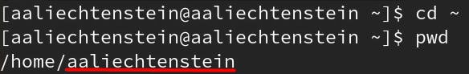{#fig:001 width=100%}

Выполним следующие действия:

Перейдем в каталог /tmp и выведем его содержимое на экран командой, используя команду ls с различными опциями (рис. [-@fig:002], [-@fig:003], [-@fig:004])

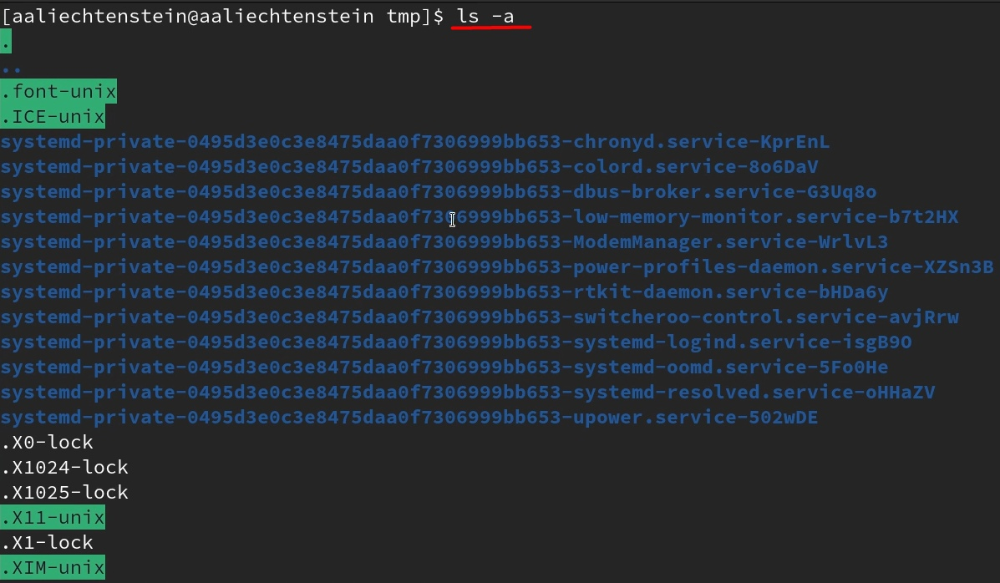{#fig:002 width=100%}

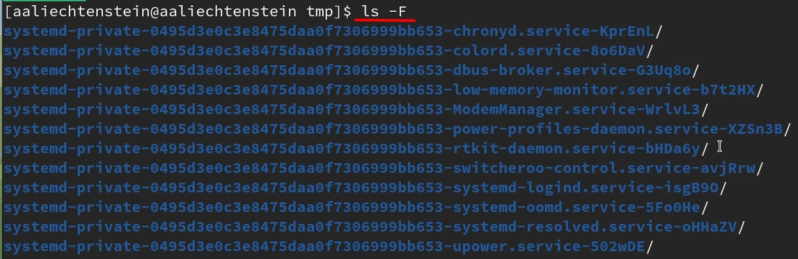{#fig:003 width=100%}

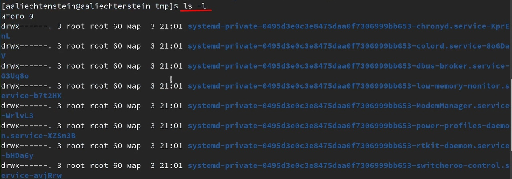{#fig:004 width=100%}

Определим, есть ли в каталоге /var/spool подкаталог с именем cron (рис. [-@fig:005])

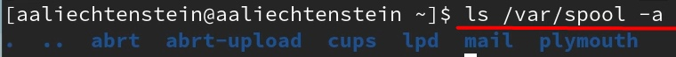{#fig:005 width=100%}

Как можно заметить по рис. [-@fig:005], то каталог /var/spool не имеет подкаталога с именем cron.

Перейдем в домашний каталог и выведем на экран его содержимое (рис. [-@fig:006])

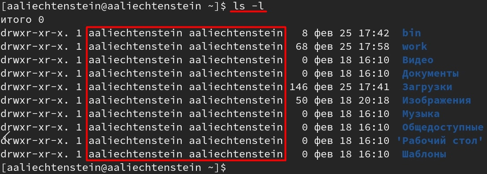{#fig:006 width=100%}

Заметим, что владельцем файлов и подкаталогов является aaliechtenstein (рис. [-@fig:006]).

Выполним следующие действия:

В домашнем каталоге создадим новый каталог с именем newdir (рис. [-@fig:007])

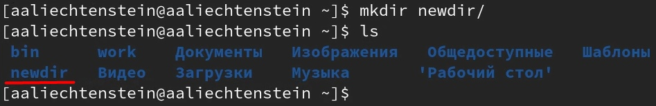{#fig:007 width=100%}

В каталоге ~/newdir создадим новый каталог с именем morefun (рис. [-@fig:008])

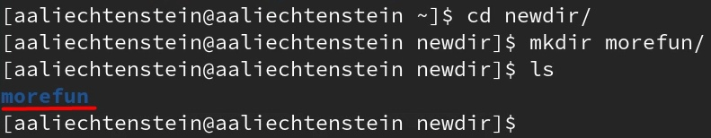{#fig:008 width=100%}

В домашнем каталоге создадим одной командой три новых каталога с именами letters, memos, misk (рис. [-@fig:009]). Затем удалим эти каталоги одной командой (рис. [-@fig:010])

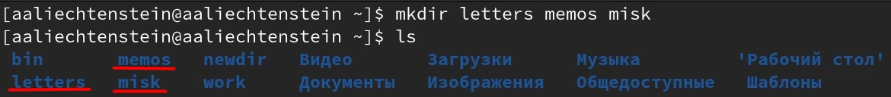{#fig:009 width=100%}

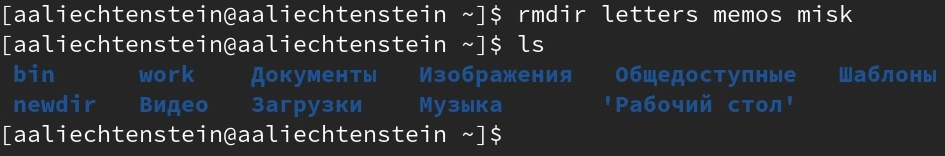{#fig:010 width=100%}

Попробуем удалить ранее созданный каталог ~/newdir командой rm (рис. [-@fig:011])

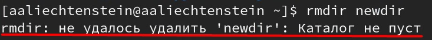{#fig:011 width=100%}

Заметим, что каталог ~/newdir/ не удалось удалить, поскольку он не пуст.

Удалим каталог ~/newdir/morefun. Проверим, был ли каталог удалён (рис. [-@fig:012])

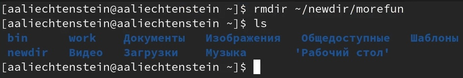{#fig:012 width=100%}

Заметим, что каталог ~/newdir/morefun удалось удалить, поскольку он был пуст.

С помощью команды man определим, какую опцию команды ls нужно использовать для просмотра содержимого не только указанного каталога, но и подкаталогов, входящих в него (рис. [-@fig:013])

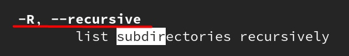{#fig:013 width=100%}

С помощью команды man определим набор опций команды ls, позволяющей отсортировать по времени последнего изменения выводимый список содержимого каталога с развёрнутым описанием файлов (рис. [-@fig:014])

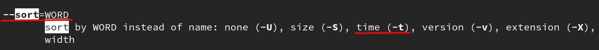{#fig:014 width=100%}

Используем команду man для просмотра описания следующих команд: cd (рис. [-@fig:015]), pwd (рис. [-@fig:016]), mkdir (рис. [-@fig:017]), rmdir (рис. [-@fig:018]), rm (рис. [-@fig:019])

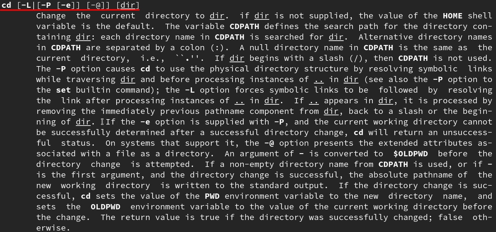{#fig:015 width=100%}

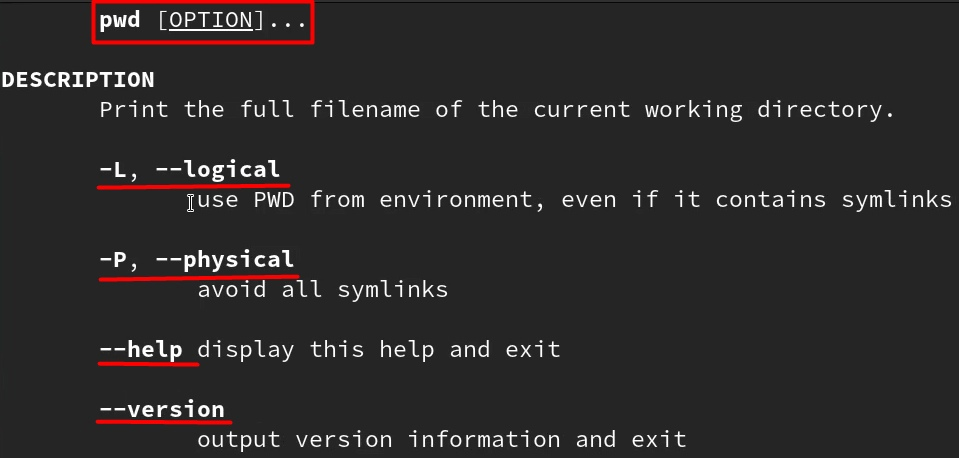{#fig:016 width=100%}

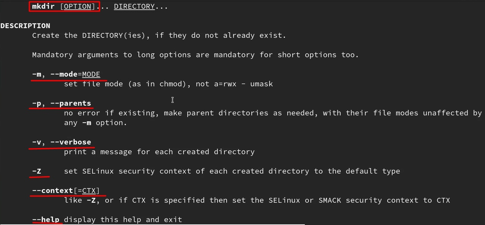{#fig:017 width=100%}

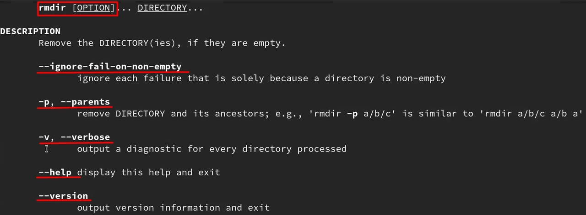{#fig:018 width=100%}

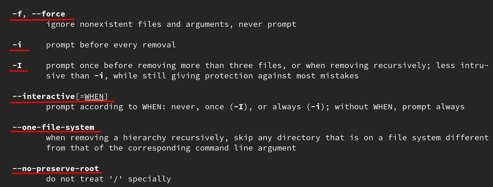{#fig:019 width=100%}

Используем информацию, полученную при помощи команды history, выполним модификацию и исполнение нескольких команд из буфера команд (рис. [-@fig:020], [-@fig:021])

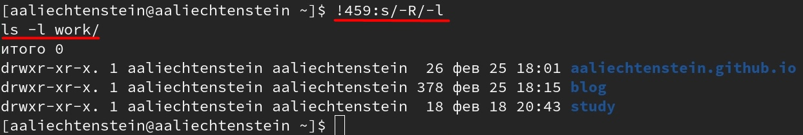{#fig:020 width=100%}

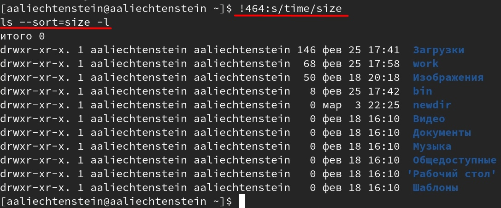{#fig:021 width=100%}

# Выводы

В процессе работы были приобретены практические навыки взаимодействия пользователя с системой посредством командной строки.
