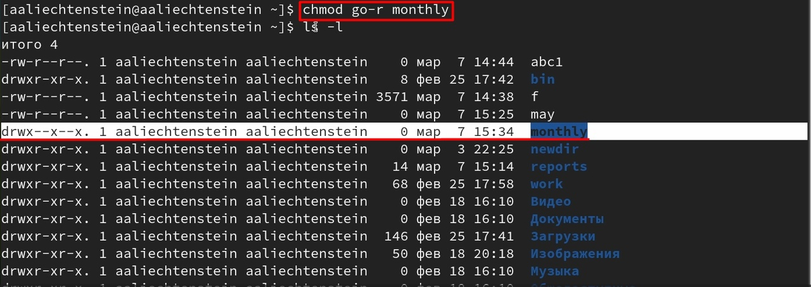

---
## Front matter
title: "ОТЧЕТ О ВЫПОЛНЕНИИ ЛАБОРАТОРНОЙ РАБОТЫ №5"
subtitle: "_дисциплина: Операционные системы_"
author: "Лихтенштейн Алина Алексеевна"

## Generic otions
lang: ru-RU
toc-title: "Содержание"

## Bibliography
bibliography: bib/cite.bib
csl: pandoc/csl/gost-r-7-0-5-2008-numeric.csl

## Pdf output format
toc: true # Table of contents
toc-depth: 2
lof: true # List of figures
lot: false # List of tables
fontsize: 12pt
linestretch: 1.5
papersize: a4
documentclass: scrreprt
## I18n polyglossia
polyglossia-lang:
  name: russian
  options:
	- spelling=modern
	- babelshorthands=true
polyglossia-otherlangs:
  name: english
## I18n babel
babel-lang: russian
babel-otherlangs: english
## Fonts
mainfont: PT Serif
romanfont: PT Serif
sansfont: PT Sans
monofont: PT Mono
mainfontoptions: Ligatures=TeX
romanfontoptions: Ligatures=TeX
sansfontoptions: Ligatures=TeX,Scale=MatchLowercase
monofontoptions: Scale=MatchLowercase,Scale=0.9
## Biblatex
biblatex: true
biblio-style: "gost-numeric"
biblatexoptions:
  - parentracker=true
  - backend=biber
  - hyperref=auto
  - language=auto
  - autolang=other*
  - citestyle=gost-numeric
## Pandoc-crossref LaTeX customization
figureTitle: "Рис."
tableTitle: "Таблица"
listingTitle: "Листинг"
lofTitle: "Список иллюстраций"
lotTitle: "Список таблиц"
lolTitle: "Листинги"
## Misc options
indent: true
header-includes:
  - \usepackage{indentfirst}
  - \usepackage{float} # keep figures where there are in the text
  - \floatplacement{figure}{H} # keep figures where there are in the text
---
  
# Цель работы

Ознакомление с файловой системой Linux, её структурой, именами и содержанием каталогов. Приобретение практических навыков по применению команд для работы с файлами и каталогами, по управлению процессами (и работами), по проверке использования диска и обслуживанию файловой системы.
# Задание

1. Выполните все примеры, приведённые в первой части описания лабораторной работы.
2. Выполните следующие действия, зафиксировав в отчёте по лабораторной работе используемые при этом команды и результаты их выполнения:
- 2.1. Скопируйте файл /usr/include/sys/io.h в домашний каталог и назовите его equipment. Если файла io.h нет, то используйте любой другой файл в каталоге /usr/include/sys/ вместо него.
- 2.2. В домашнем каталоге создайте директорию ~/ski.plases.
- 2.3. Переместите файл equipment в каталог ~/ski.plases.
- 2.4. Переименуйте файл ~/ski.plases/equipment в ~/ski.plases/equiplist.
- 2.5. Создайте в домашнем каталоге файл abc1 и скопируйте его в каталог ~/ski.plases, назовите его equiplist2.
- 2.6. Создайте каталог с именем equipment в каталоге ~/ski.plases.
- 2.7. Переместите файлы ~/ski.plases/equiplist и equiplist2 в каталог ~/ski.plases/equipment.
- 2.8. Создайте и переместите каталог ~/newdir в каталог ~/ski.plases и назовите его plans.
3. Определите опции команды chmod, необходимые для того, чтобы присвоить перечисленным ниже файлам выделенные права доступа, считая, что в начале таких прав нет:
- 3.1. drwxr--r-- ... australia
- 3.2. drwx--x--x ... play
- 3.3. -r-xr--r-- ... my_os
- 3.4. -rw-rw-r-- ... feathers
При необходимости создайте нужные файлы.
4. Проделайте приведённые ниже упражнения, записывая в отчёт по лабораторной работе используемые при этом команды:
- 4.1. Просмотрите содержимое файла /etc/password.
- 4.2. Скопируйте файл ~/feathers в файл ~/file.old.
- 4.3. Переместите файл ~/file.old в каталог ~/play.
- 4.4. Скопируйте каталог ~/play в каталог ~/fun.
- 4.5. Переместите каталог ~/fun в каталог ~/play и назовите его games.
- 4.6. Лишите владельца файла ~/feathers права на чтение.
- 4.7. Что произойдёт, если вы попытаетесь просмотреть файл ~/feathers командой cat?
- 4.8. Что произойдёт, если вы попытаетесь скопировать файл ~/feathers?
- 4.9. Дайте владельцу файла ~/feathers право на чтение.
- 4.10. Лишите владельца каталога ~/play права на выполнение.
- 4.11. Перейдите в каталог ~/play. Что произошло?
- 4.12. Дайте владельцу каталога ~/play право на выполнение.
5. Прочитайте man по командам mount, fsck, mkfs, kill и кратко их охарактеризуйте, приведя примеры.

# Теоретическое введение

## Команды для работы с файлами и каталогами.

- Для создания текстового файла можно использовать команду touch. Формат команды:  touch имя-файла
- Для просмотра файлов небольшого размера можно использовать команду cat.Формат команды: cat имя-файла
- Для просмотра файлов постранично удобнее использовать команду less. Формат команды: less имя-файла
- Следующие клавиши используются для управления процессом просмотра: Space — переход к следующей странице,ENTER — сдвиг вперёд на одну строку, b — возврат на предыдущую страницу, h — обращение за подсказкой, q — выход из режима просмотра файла.
- Команда head выводит по умолчанию первые 10 строк файла. Формат команды: head -n имя-файла, где n — количество выводимых строк.
- Команда tail выводит умолчанию 10 последних строк файла. Формат команды: tail -n имя-файла, где n — количество выводимых строк.

## Копирование файлов и каталогов

- Команда cp используется для копирования файлов и каталогов. Формат команды: cp -опции исходный_файл целевой_файл

##  Перемещение и переименование файлов и каталогов

- Команды mv и mvdir предназначены для перемещения и переименования файлов и каталогов. Формат команды mv: mv -опции старый_файл новый_файл

## Права доступа

Каждый файл или каталог имеет права доступа. В сведениях о файле или каталоге указываются:
- тип файла (символ (-) обозначает файл, а символ (d) — каталог);
- права для владельца файла (r — разрешено чтение, w — разрешена запись, x — разрешено выполнение, - — право доступа отсутствует);
- права для членов группы (r — разрешено чтение, w — разрешена запись, x — разрешено выполнение, - — право доступа отсутствует);
- права для всех остальных (r — разрешено чтение, w — разрешена запись, x — разрешено выполнение, - — право доступа отсутствует).

## Изменение прав доступа 

- Права доступа к файлу или каталогу можно изменить, воспользовавшись командой chmod. Сделать это может владелец файла (или каталога) или пользователь с правами администратора. Формат команды: chmod режим имя_файла

## Анализ файловой системы

Файловая система в Linux состоит из фалов и каталогов. Каждому физическому носителю соответствует своя файловая система. Существует несколько типов файловых систем. Перечислим наиболее часто встречающиеся типы:
- ext2fs (second extended filesystem);
- ext2fs (third extended file system);
- ext4 (fourth extended file system);
- ReiserFS;
- xfs;
- fat (file allocation table);
- ntfs (new technology file system).

Для просмотра используемых в операционной системе файловых систем можно воспользоваться командой mount без параметров.

# Выполнение лабораторной работы

1. Выполните все примеры, приведённые в первой части описания лабораторной работы.

- Команды для работы с файлами и каталогами

Для создания текстового файла воспользуемся командой touch (рис. [-@fig:001])

{#fig:001 width=100%}

Для просмотра файлов небольшого размера можно используем команду cat (рис. [-@fig:002])

{#fig:002 width=100%}

С помощью команды head выведем первые 3 строк файла (рис. [-@fig:003])

{#fig:003 width=100%}

С помощью команды tail выведем 5 последних строк файла (рис. [-@fig:004])

{#fig:004 width=100%}

- Копирование файлов и каталогов

Скопируем файл ~/abc1 в файл april и в файл may (рис. [-@fig:005])

{#fig:005 width=100%}

Скопируем файлы april и may в каталог monthly (рис. [-@fig:006])

{#fig:006 width=100%}

Скопируем каталог monthly в каталог monthly.00. А затем каталог monthly.00
в каталог /tmp (рис. [-@fig:007])

{#fig:007 width=100%}

- Перемещение и переименование файлов и каталогов

Изменим название файла april на july в домашнем каталоге. Затем переместим файл july в каталог monthly.00. Переименуем каталог monthly.00 в monthly.01.  Переместить каталог monthly.01в каталог reports и переименуем каталог
reports/monthly.01 в reports/monthly (рис. [-@fig:008])

{#fig:008 width=100%}

-   Изменение прав доступа

Создадим файл ~/may с правом выполнения для владельца и лишим владельца файла ~/may права на выполнение (рис. [-@fig:009])

{#fig:009 width=100%}

Создадим каталог monthly с запретом на чтение для членов группы и всех
остальных пользователей (рис. [-@fig:010]) (рис. [-@fig:011]) 

{#fig:010 width=100%}

{#fig:011 width=100%}

Создадим файл ~/abc1 с правом записи для членов группы (рис. [-@fig:012])

{#fig:012 width=100%}

- Анализ файловой системы

Воспользуемся командой mount для просмотра используемых в операционной системе файловых систем (рис. [-@fig:013])

{#fig:013 width=100%}

Другой способ - команда cat /etc/fstab (рис. [-@fig:014])

{#fig:014 width=100%}

Воспользуемся командой df для определения объёма свободного пространства на файловой системе (рис. [-@fig:015])

{#fig:015 width=100%}

Скопируем файл /usr/include/sys/io.h в домашний каталог и назовем его equipment (рис. [-@fig:016])

{#fig:016 width=100%}

В домашнем каталоге создадим директорию ~/ski.plases (рис. [-@fig:017])

{#fig:017 width=100%}

Переименуем файл ~/ski.plases/equipment в ~/ski.plases/equiplist. (рис. [-@fig:018])

{#fig:018 width=100%}

Создадим в домашнем каталоге файл abc1 и скопируем его в каталог ~/ski.plases, назовем его equiplist2 (рис. [-@fig:019]) 

{#fig:019 width=100%}

Создадим каталог с именем equipment в каталоге ~/ski.plases (рис. [-@fig:020]) 

{#fig:020 width=100%}

Переместим файлы ~/ski.plases/equiplist и equiplist2 в каталог ~/ski.plases/equipment (рис. [-@fig:021]) 

{#fig:021 width=100%}

Создадим и переместим каталог ~/newdir в каталог ~/ski.plases и назовем его plans (рис. [-@fig:022]) 

{#fig:022 width=100%}

Определим опции команды chmod, необходимые для того, чтобы присвоить перечисленным ниже файлам выделенные права доступа, считая, что в начале таких прав нет (рис. [-@fig:024]) 
3.1. drwxr--r-- ... australia
3.2. drwx--x--x ... play
3.3. -r-xr--r-- ... my_os
3.4. -rw-rw-r-- ... feathers 

{#fig:024 width=100%}

Просмотрим содержимое файла /etc/passwd (рис. [-@fig:025]) (рис. [-@fig:026]) 

{#fig:025 width=100%}

{#fig:026 width=100%}

Скопируем файл ~/feathers в файл ~/file.old (рис. [-@fig:027])

{#fig:027 width=100%}

Переместим файл ~/file.old в каталог ~/play (рис. [-@fig:028])

{#fig:028 width=100%}

Переместите каталог ~/fun в каталог ~/play и назовите его games (рис. [-@fig:029])

{#fig:029 width=100%}

Лишим владельца файла ~/feathers права на чтение (рис. [-@fig:030])

{#fig:030 width=100%}

Проверим, что произойдёт, если мы попытаемся просмотреть файл ~/feathers командой cat (рис. [-@fig:031])
Будет отказано в доступе

{#fig:031 width=100%}

Проверим, что произойдёт, если мы попытаемся скопировать файл ~/feathers (рис. [-@fig:032])
Будет отказано в доступе

{#fig:032 width=100%}

Дадим владельцу файла ~/feathers право на чтение (рис. [-@fig:040])

{#fig:040 width=100%}

Лишим владельца каталога ~/play права на выполнение (рис. [-@fig:033])

{#fig:033 width=100%}

Перейдем в каталог ~/play (рис. [-@fig:034])
Будет отказано в доступе

{#fig:034 width=100%}

Дадим владельцу каталога ~/play право на выполнение (рис. [-@fig:035])

{#fig:035 width=100%}

Прочитаем man по командам mount, fsck, mkfs, kill (рис. [-@fig:036]) (рис. [-@fig:037]) (рис. [-@fig:038]) (рис. [-@fig:039])

{#fig:036 width=100%}

{#fig:037 width=100%}

{#fig:038 width=100%}

{#fig:039 width=100%}

# Выводы

Мы ознакомились с файловой системой Linux, её структурой, именами и содержанием каталогов. Приобрели практические навыки по применению команд для работы с файлами и каталогами, по управлению процессами (и работами), по проверке использования диска и обслуживанию файловой системы.

