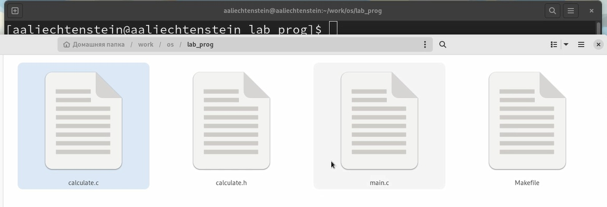
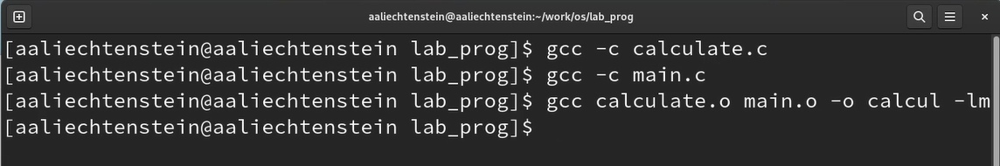
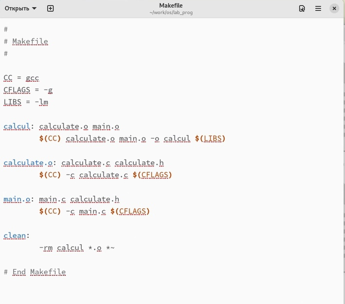
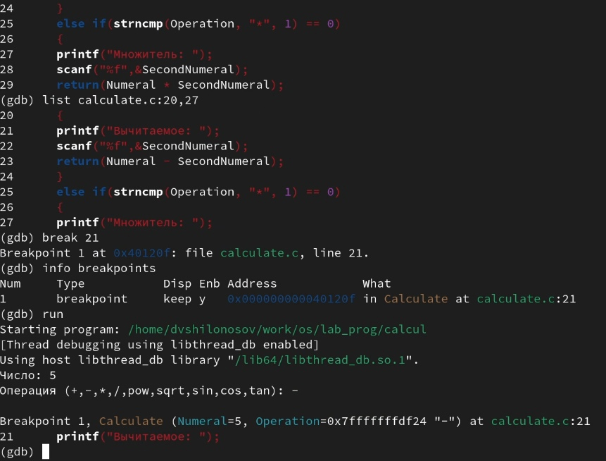
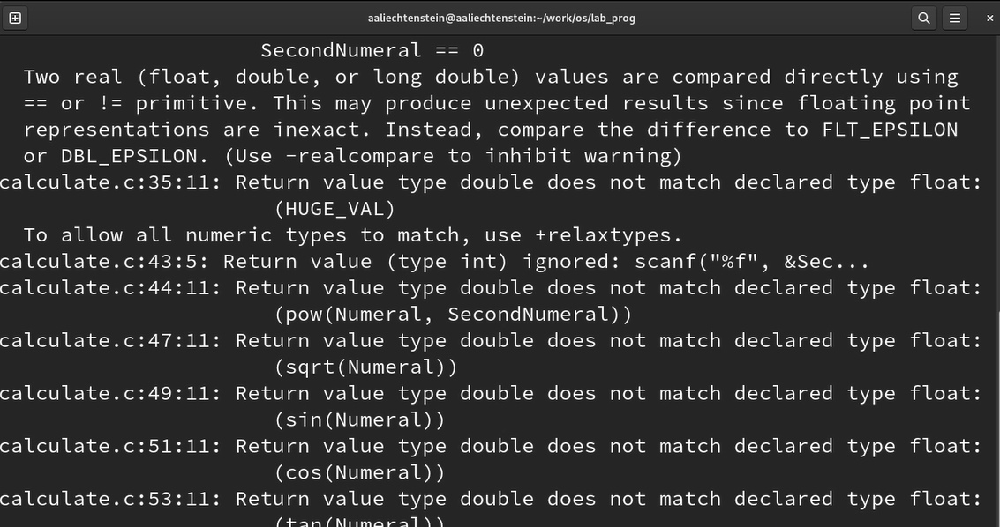
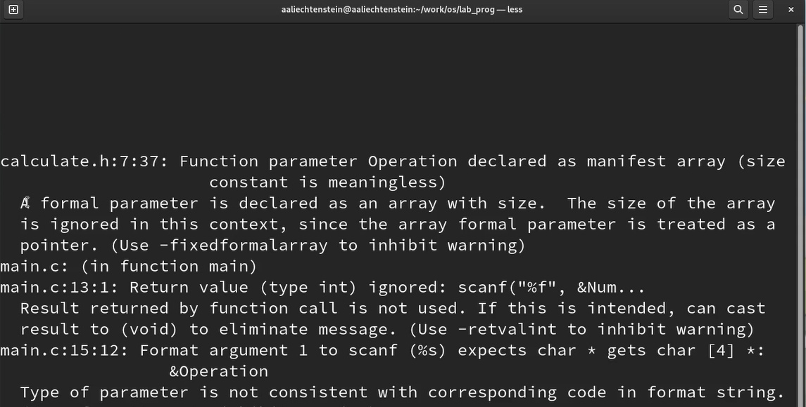

---
## Front matter
lang: ru-RU
title: Лабораторная работа №13
subtitle: Курс "Операционные Системы"
author:
  -  Лихтенштейн А.А., НКАбд-03-22 
institute:
  - Российский университет дружбы народов, Москва, Россия
  
date: 6 мая 2023
## i18n babel
babel-lang: russian
babel-otherlangs: english

## Formatting pdf
toc: false
toc-title: Содержание
slide_level: 2
aspectratio: 169
section-titles: true
theme: metropolis
header-includes:
 - \metroset{progressbar=frametitle,sectionpage=progressbar,numbering=fraction}
 - '\makeatletter'
 - '\beamer@ignorenonframefalse'
 - '\makeatother'
---

## Докладчик

:::::::::::::: {.columns align=center}
::: {.column width="70%"}

  * Лихтенштейн Алина Алексеевна
  * студент группы НКАбд-03-22
  * кафедры Компьютерные и информационные науки 
  * Российский университет дружбы народов
  * [1132229533@pfur.ru](mailto:1132229533@pfur.ru)
  

:::
::: {.column width="30%"}

:::
::::::::::::::

## Цели и задачи

- Приобрести простейшие навыки разработки, анализа, тестирования и отладки приложений в ОС типа UNIX/Linux на примере создания на языке программирования С калькулятора с простейшими функциями.

# Выполнение заданий.

## В домашнем каталоге создайте подкаталог ~/work/os/lab_prog. Создайте в нём файлы: calculate.h, calculate.c, main.c

{#fig:001 width=70%}

## Выполните компиляцию программы посредством gcc. При необходимости исправьте синтаксические ошибки

{#fig:002 width=60%}

## Создайте Makefile

{#fig:003 width=60%}

## С помощью gdb выполните отладку программы calcul (перед использованием gdb исправьте Makefile)

{#fig:004 width=70%}

## С помощью утилиты splint попробуйте проанализировать коды файлов calculate.c и main.c

{#fig:005 width=70%}

##

{#fig:006 width=70%}

# Результаты

## Выводы

При выполнениии данной лабораторной работы я приобрела простейшие навыки разработки, анализа, тестирования и отладки приложений в ОС типа UNIX/Linux на примере создания на языке программирования С калькулятора с простейшими функциями.

