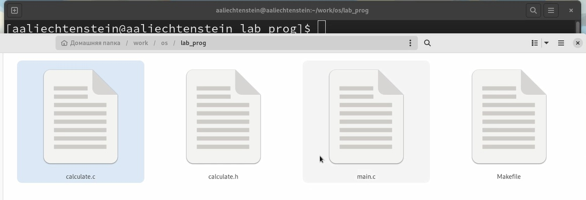
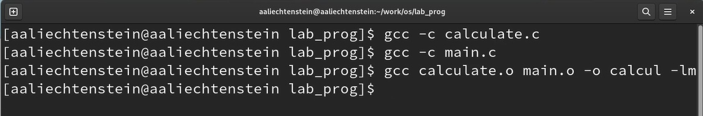
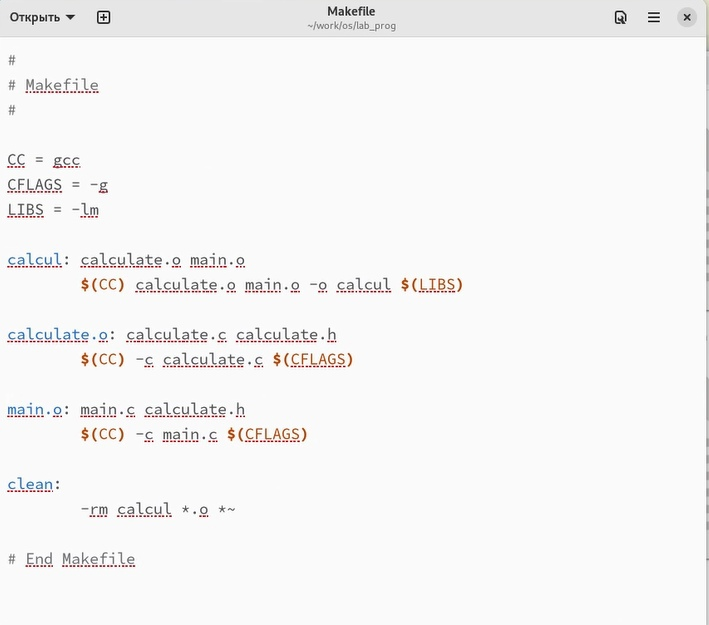
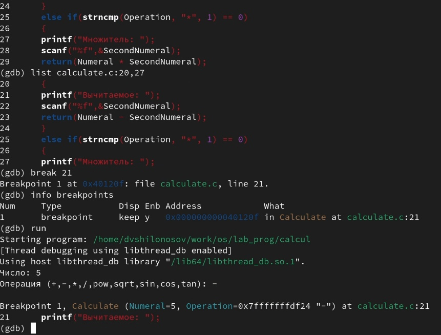
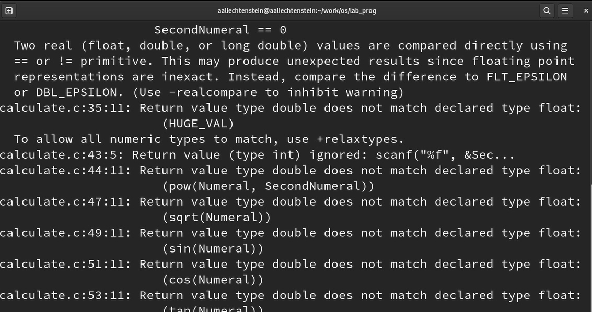
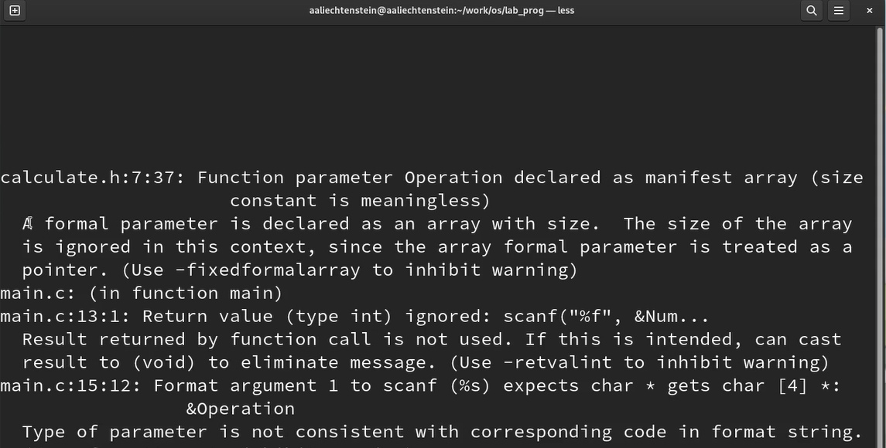

---
## Front matter
title: "ОТЧЕТ О ВЫПОЛНЕНИИ ЛАБОРАТОРНОЙ РАБОТЫ №13"
subtitle: "_дисциплина: Операционные системы_"
author: "Лихтенштейн Алина Алексеевна"

## Generic otions
lang: ru-RU
toc-title: "Содержание"

## Bibliography
bibliography: bib/cite.bib
csl: pandoc/csl/gost-r-7-0-5-2008-numeric.csl

## Pdf output format
toc: true # Table of contents
toc-depth: 2
lof: true # List of figures
lot: false # List of tables
fontsize: 12pt
linestretch: 1.5
papersize: a4
documentclass: scrreprt
## I18n polyglossia
polyglossia-lang:
  name: russian
  options:
	- spelling=modern
	- babelshorthands=true
polyglossia-otherlangs:
  name: english
## I18n babel
babel-lang: russian
babel-otherlangs: english
## Fonts
mainfont: PT Serif
romanfont: PT Serif
sansfont: PT Sans
monofont: PT Mono
mainfontoptions: Ligatures=TeX
romanfontoptions: Ligatures=TeX
sansfontoptions: Ligatures=TeX,Scale=MatchLowercase
monofontoptions: Scale=MatchLowercase,Scale=0.9
## Biblatex
biblatex: true
biblio-style: "gost-numeric"
biblatexoptions:
  - parentracker=true
  - backend=biber
  - hyperref=auto
  - language=auto
  - autolang=other*
  - citestyle=gost-numeric
## Pandoc-crossref LaTeX customization
figureTitle: "Рис."
tableTitle: "Таблица"
listingTitle: "Листинг"
lofTitle: "Список иллюстраций"
lotTitle: "Список таблиц"
lolTitle: "Листинги"
## Misc options
indent: true
header-includes:
  - \usepackage{indentfirst}
  - \usepackage{float} # keep figures where there are in the text
  - \floatplacement{figure}{H} # keep figures where there are in the text
---
  
# Цель работы

Приобрести простейшие навыки разработки, анализа, тестирования и отладки приложений в ОС типа UNIX/Linux на примере создания на языке программирования
С калькулятора с простейшими функциями.

# Задание

1. В домашнем каталоге создайте подкаталог ~/work/os/lab_prog.
2. Создайте в нём файлы: calculate.h, calculate.c, main.c. Это будет примитивнейший калькулятор, способный складывать, вычитать, умножать и делить, возводить число в степень, брать квадратный корень, вычислять sin, cos, tan. При запуске он будет запрашивать первое число, операцию, второе число. После этого программа выведет результат и остановится.
3. Выполните компиляцию программы посредством gcc.
4. При необходимости исправьте синтаксические ошибки.
5. Создайте Makefile со следующим содержанием.
6. С помощью gdb выполните отладку программы calcul (перед использованием gdb исправьте Makefile)
7. С помощью утилиты splint попробуйте проанализировать коды файлов calculate.c и main.c.

# Теоретическое введение

Процесс разработки программного обеспечения обычно разделяется на следующие этапы:

- планирование, включающее сбор и анализ требований к функционалу и другим характеристикам разрабатываемого приложения;
- проектирование, включающее в себя разработку базовых алгоритмов и спецификаций,
- определение языка программирования;
- непосредственная разработка приложения;
- кодирование — по сути создание исходного текста программы (возможно в нескольких вариантах);
- анализ разработанного кода;
- сборка, компиляция и разработка исполняемого модуля;
- тестирование и отладка, сохранение произведённых изменений;
- документирование.

# Выполнение лабораторной работы

# Выполнение лабораторной работы

1. В домашнем каталоге создайте подкаталог ~/work/os/lab_prog.

2. Создайте в нём файлы: calculate.h, calculate.c, main.c. Это будет примитивнейший калькулятор, способный складывать, вычитать, умножать и делить, возводить число в степень, брать квадратный корень, вычислять sin, cos, tan. При запуске он будет запрашивать первое число, операцию, второе число. После этого программа выведет результат и остановится (рис. @fig:001)

{#fig:001 width=70%}

3. Выполните компиляцию программы посредством gcc.
4. При необходимости исправьте синтаксические ошибки (рис. @fig:002) 

{#fig:002 width=70%}

5. Создайте Makefile (рис. @fig:003) 

{#fig:003 width=70%}

Объяснение файла: 

```
#Объявление переменных
CC = gcc #компилятор
CFLAGS = -g #опция, которая отладочную информацию положит в результирующий бинарн
LIBS = -lm
#Создаем файл calcul из файлов calculate.o main.o
calcul: calculate.o main.o #ниже обращаемся к содержимому переменной
    $(CC) calculate.o main.o -o calcul $(LIBS) #добавляем опцию
#Здесь отражена строчка: gcc calculate.o main.o -o calcul -lm
#Создаем файл calculate.o
calculate.o: calculate.c calculate.h #
    $(CC) -c calculate.c $(CFLAGS) #gcc -c calculate.c -g
#Создаем файл main.o
main.o: main.c calculate.h #gcc -c main.c -g
    $(CC) -c main.c $(CFLAGS) #
#
clean: #при вызове make clean будем удалять все файлы с разрешением .о
    -rm calcul *.o *~ #
```

6. С помощью gdb выполните отладку программы calcul (перед использованием gdb исправьте Makefile)(рис. @fig:004)

{#fig:004 width=70%}


7. С помощью утилиты splint попробуйте проанализировать коды файлов calculate.c и main.c (рис. @fig:005, @fig:006)

{#fig:005 width=70%}

{#fig:006 width=70%}


# Выводы

При выполнении данной лабораторной работы я приобрела простейшие навыки разработки, анализа, тестирования и отладки приложений в ОС типа UNIX/Linux на примере создания на языке программирования С калькулятора с простейшими функциями.


