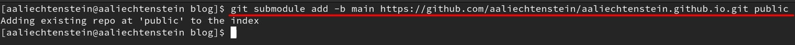

---
## Front matter
lang: ru-RU
title: ОТЧЕТ О ВЫПОЛНЕНИИ ИНДИВИДУАЛЬНОГО ПРОЕКТА. ЭТАП №1
subtitle: Курс "Операционные Системы"
author:
  - Лихтенштейн А.А. , НКАбд-03-22
institute:
  - Российский университет дружбы народов, Москва, Россия
  
date: 25 февраля 2023

## i18n babel
babel-lang: russian
babel-otherlangs: english

## Formatting pdf
toc: false
toc-title: Содержание
slide_level: 2
aspectratio: 169
section-titles: true
theme: metropolis
header-includes:
 - \metroset{progressbar=frametitle,sectionpage=progressbar,numbering=fraction}
 - '\makeatletter'
 - '\beamer@ignorenonframefalse'
 - '\makeatother'
---

## Докладчик

:::::::::::::: {.columns align=center}
::: {.column width="40%"}

  * Лихтенштейн Алина Алексеевна
  * студент группы НКАбд-03-22
  * кафедры Компьютерные и информационные науки 
  * Российский университет дружбы народов
  * [1132229533@pfur.ru](mailto:1132229533@pfur.ru)
  

:::
::: {.column width="30%"}

:::
::::::::::::::

## Цели и задачи
1. Установить необходимое программное обеспечение.
2. Скачать шаблон темы сайта.
3. Разместить его на хостинге git.
4. Установить параметр для URLs сайта.
5. Разместить заготовку сайта на Github pages.

# Выполнение лабораторной работы 

## Скачивание архива

Скачиваем архив hugo_extended_0.110.0_Linux-64bit.tar.gz

{#fig:001 width=70%}

## Создание директории в домашнем каталоге. Перенос исходного файла hugo

Создаем в домашнем каталоге папку bin  и переносим исходный файл hugo в каталог ~/bin 
{#fig:002 width=70%}

## Создание репозитория "blog"

Создаем репозиторий с именем "blog" по шаблону wowchemy/starter-hugo-academic

{#fig:003 width=30%}

## Переход в рабочую директорию и клонирование репозитория "blog"]

Переходим в каталог, где располагаются все наши репозитории, связанные с выполнением лабораторных работ и клонируем созданный репозиторий "blog" в ~/work

{#fig:004 width=70%}

## Команда ~/bin/hugo server и локальный адрес

Выполняем команду ~/bin/hugo server и с помощью полученного локального адреса переходим на веб-сайт

{#fig:005 width=70%}

## Команда ~/bin/hugo server и локальный адрес

{#fig:006 width=70%}

## Создание репозитория aaliechtenstein.github.io

Создаем репозиторий с именем "aaliechtenstein.github.io"

{#fig:007 width=70%}

## Клонирование репозитория aaliechtenstein.github.io

Клонируем созданный репозиторий в ~/work 

{#fig:008 width=70%}

## Создание ветки main

Переходим в репозиторий "aaliechtenstein.github.io" и создаем ветку "main" 

{#fig:009 width=70%}

## Создание файла README.md. Отправка всех изменений на сервер

Создаем файл README.md и отправляем изменения на сервер репозитория 

{#fig:010 width=70%}

## Комментирование каталога "public" в файле ".gitignore"

С помощью mcedit закомментируем каталог "public" в файле ".gitignore" репозитория "blog" 

{#fig:011 width=10%}

## Подключение модуль-директории

Подключаем к репозиторию "aaliechtenstein.github.io" модуль-директории "public" 

{#fig:012 width=70%}

## Запуск исполняемого файла hugo

Запуск исполняемого файла hugo командой ~/bin/hugo в репозитории "blog" 

{#fig:013 width=70%}

## Проверка соединения репозиториев

Проверим, соединены ли репозитории "blog" и "aaliechtenstein.github.io"

{#fig:014 width=70%}

## Отправка всех изменений на сервер

Отправим все изменения на сервер 

{#fig:015 width=70%}

## Проверка работоспособности сайта

Проверка работоспособности сайта по публичному адресу на основной ОС 

{#fig:016 width=70%}

## Выводы

Были размещены заготовки персонального сайта на Github pages: установлено необходимое ПО, скачан шаблон темы сайта, размещенный на хостинге git, установлены параметры для URLs сайта.
