---
## Front matter
title: "ОТЧЕТ О ВЫПОЛНЕНИИ ИНДИВИДУАЛЬНОГО ПРОЕКТА. ЭТАП №1"
subtitle: "_дисциплина: Операционные системы_"
author: "Лихтенштейн Алина Алексеевна"

## Generic otions
lang: ru-RU
toc-title: "Содержание"

## Bibliography
bibliography: bib/cite.bib
csl: pandoc/csl/gost-r-7-0-5-2008-numeric.csl

## Pdf output format
toc: true # Table of contents
toc-depth: 2
lof: true # List of figures
lot: false # List of tables
fontsize: 12pt
linestretch: 1.5
papersize: a4
documentclass: scrreprt
## I18n polyglossia
polyglossia-lang:
  name: russian
  options:
	- spelling=modern
	- babelshorthands=true
polyglossia-otherlangs:
  name: english
## I18n babel
babel-lang: russian
babel-otherlangs: english
## Fonts
mainfont: PT Serif
romanfont: PT Serif
sansfont: PT Sans
monofont: PT Mono
mainfontoptions: Ligatures=TeX
romanfontoptions: Ligatures=TeX
sansfontoptions: Ligatures=TeX,Scale=MatchLowercase
monofontoptions: Scale=MatchLowercase,Scale=0.9
## Biblatex
biblatex: true
biblio-style: "gost-numeric"
biblatexoptions:
  - parentracker=true
  - backend=biber
  - hyperref=auto
  - language=auto
  - autolang=other*
  - citestyle=gost-numeric
## Pandoc-crossref LaTeX customization
figureTitle: "Рис."
tableTitle: "Таблица"
listingTitle: "Листинг"
lofTitle: "Список иллюстраций"
lotTitle: "Список таблиц"
lolTitle: "Листинги"
## Misc options
indent: true
header-includes:
  - \usepackage{indentfirst}
  - \usepackage{float} # keep figures where there are in the text
  - \floatplacement{figure}{H} # keep figures where there are in the text
---
  
# Цель работы

Размещение на Github pages заготовки для персонального сайта.

# Задание

- Установить необходимое программное обеспечение.
- Скачать шаблон темы сайта.
- Разместить его на хостинге git.
- Установить параметр для URLs сайта.
- Разместить заготовку сайта на Github pages.

# Выполнение лабораторной работы

Скачиваем архив hugo_extended_0.110.0_Linux-64bit.tar.gz (рис. [-@fig:001])

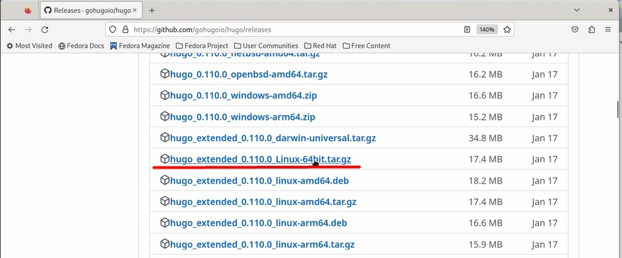{#fig:001 width=70%}

Создаем в домашнем каталоге папку bin  и переносим исходный файл hugo в каталог ~/bin (рис. [-@fig:002])

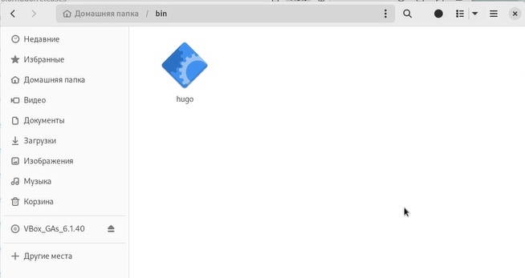{#fig:002 width=70%}

Создаем репозиторий с именем "blog" по шаблону wowchemy/starter-hugo-academic (рис. [-@fig:003])

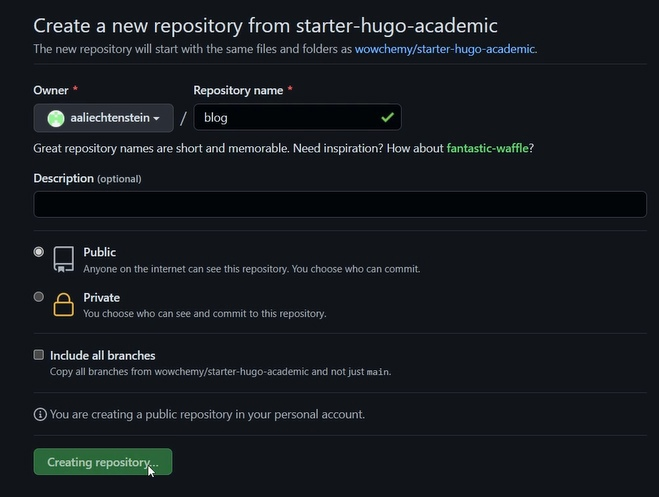{#fig:003 width=70%}

Переходим в каталог, где располагаются все наши репозитории, связанные с выполнением лабораторных работ и клонируем созданный репозиторий "blog" в ~/work(рис. [-@fig:004])

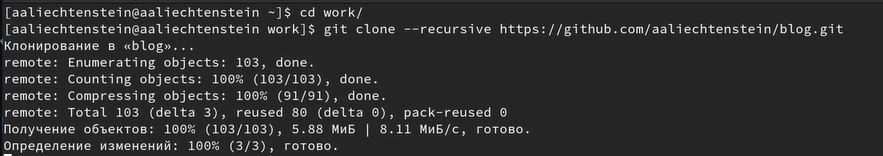{#fig:004 width=70%}

Выполняем команду ~/bin/hugo server (рис. [-@fig:005]) и с помощью полученного локального адреса переходим на веб-сайт (рис. [-@fig:006])

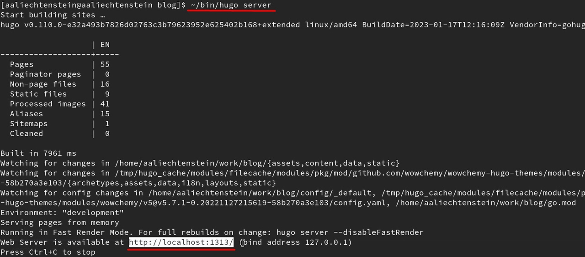{#fig:005 width=70%}

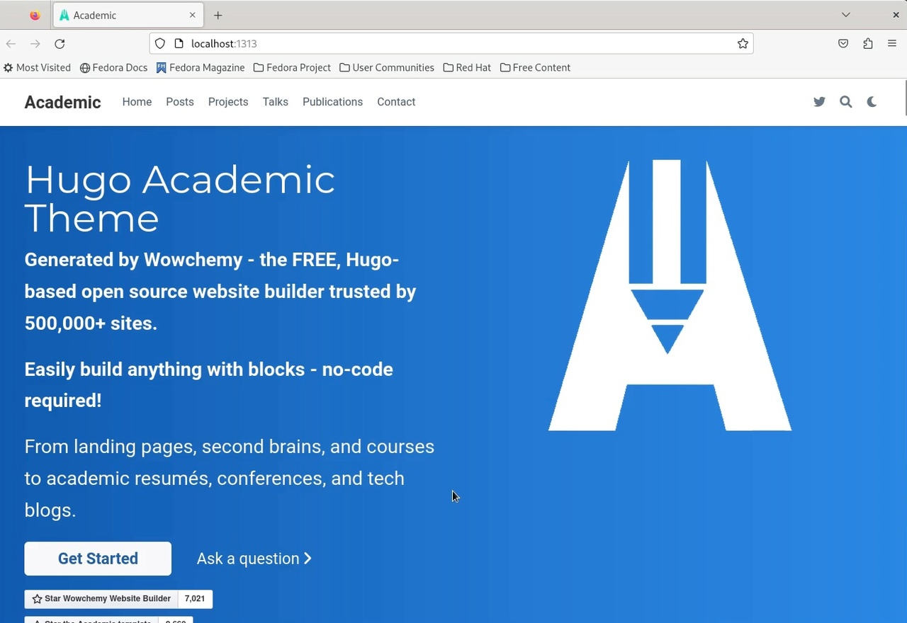{#fig:006 width=70%}

На нем расположен наш сайт, с шаблоном. Однако доступ к нему будет только у компьютера, который этот сервер запустил. Далее шаги будут направлены на то, чтобы это исправить.

Создаем репозиторий с именем "aaliechtenstein.github.io" (рис. [-@fig:007])

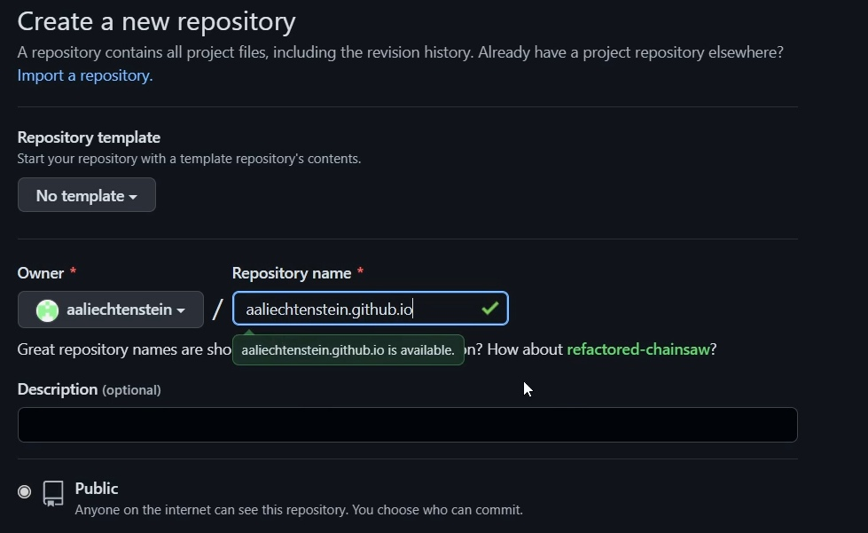{#fig:007 width=70%}

Клонируем созданный репозиторий в ~/work (рис. [-@fig:008])

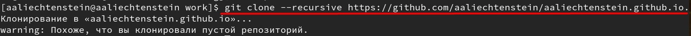{#fig:008 width=70%}

Переходим в репозиторий "aaliechtenstein.github.io" и создаем ветку "main" (рис. [-@fig:009])

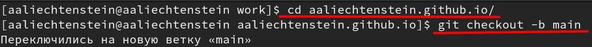{#fig:009 width=70%}

Создаем файл README.md и отправляем изменения на сервер репозитория (рис. [-@fig:010])

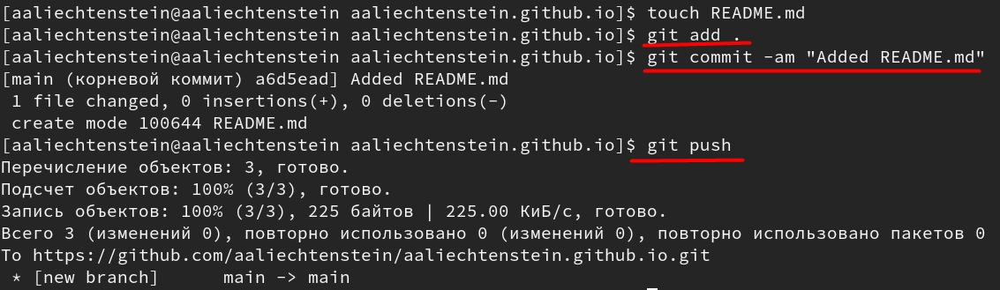{#fig:010 width=70%}

С помощью mcedit закомментируем каталог "public" в файле ".gitignore" репозитория "blog" (рис. [-@fig:011])

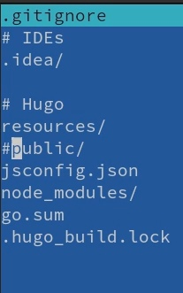{#fig:011 width=40%}

Подключаем к репозиторию "aaliechtenstein.github.io" модуль-директории "public" (рис. [-@fig:012])

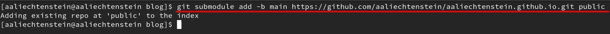{#fig:012 width=70%}

Запуск исполняемого файла hugo командой ~/bin/hugo в репозитории "blog" (рис. [-@fig:013])

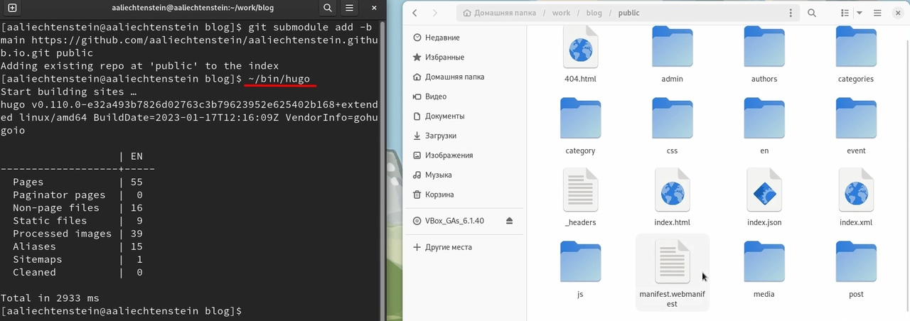{#fig:013 width=70%}

Проверим, соединены ли репозитории "blog" и "aaliechtenstein.github.io". (рис. [-@fig:014])

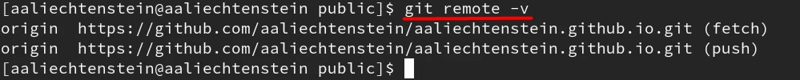{#fig:014 width=70%}

Отправим все изменения на сервер (рис. [-@fig:015])

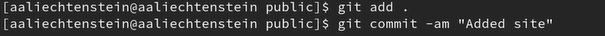{#fig:015 width=70%}

Проверка работоспособности сайта по публичному адресу на основной ОС (рис. [-@fig:016])

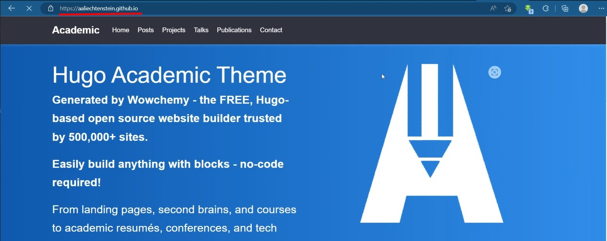{#fig:016 width=70%}

# Выводы

В ходе лабораторной работы были размещены заготовки персонального сайта на Github pages: установлено необходимое ПО, скачан шаблон темы сайта, размещенный на хостинге git, установлены параметры для URLs сайта.

