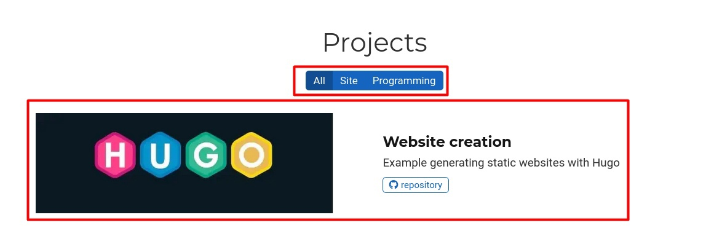
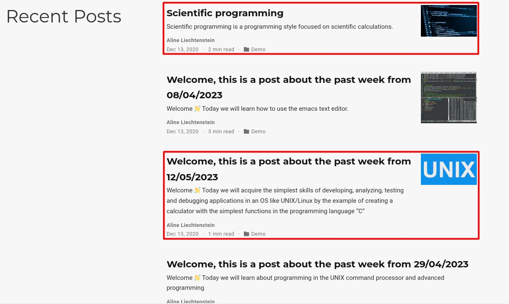

---
## Front matter
lang: ru-RU
title: ОТЧЕТ О ВЫПОЛНЕНИИ ИНДИВИДУАЛЬНОГО ПРОЕКТА. ЭТАП №5
subtitle: Курс "Операционные Системы"
author:
  - Лихтенштейн А.А. , НКАбд-03-22
institute:
  - Российский университет дружбы народов, Москва, Россия
  
date: 12 мая 2023

## i18n babel
babel-lang: russian
babel-otherlangs: english

## Formatting pdf
toc: false
toc-title: Содержание
slide_level: 2
aspectratio: 169
section-titles: true
theme: metropolis
header-includes:
 - \metroset{progressbar=frametitle,sectionpage=progressbar,numbering=fraction}
 - '\makeatletter'
 - '\beamer@ignorenonframefalse'
 - '\makeatother'
---

## Докладчик

:::::::::::::: {.columns align=center}
::: {.column width="40%"}

  * Лихтенштейн Алина Алексеевна
  * студент группы НКАбд-03-22
  * кафедры Компьютерные и информационные науки 
  * Российский университет дружбы народов
  * [1132229533@pfur.ru](mailto:1132229533@pfur.ru)
  

:::
::: {.column width="30%"}

:::
::::::::::::::

# Цель и задачи
Целью работы является добавление к сайту оставшихся элементов

1. Сделать записи для персональных проектов.
2. Сделать пост по прошедшей неделе.
3. Добавить пост на тему по выбору.

# Выполнение лабораторной работы

## Сделаем записи для персональных проектов

{#fig:001 width=100%}

## Сделаем пост по прошедшей неделе и добавим пост на тему по выбору 

{#fig:002 width=100%}

# Выводы
Были сделаны записи для персональных проектов, добавлены посты по прошедшей неделе и теме по выбору

