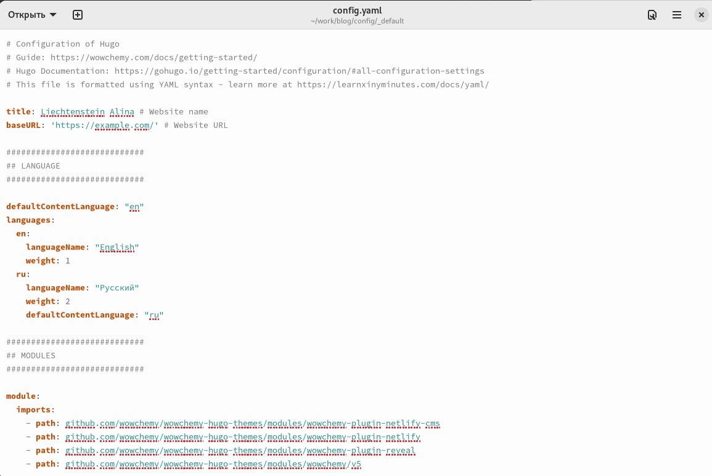
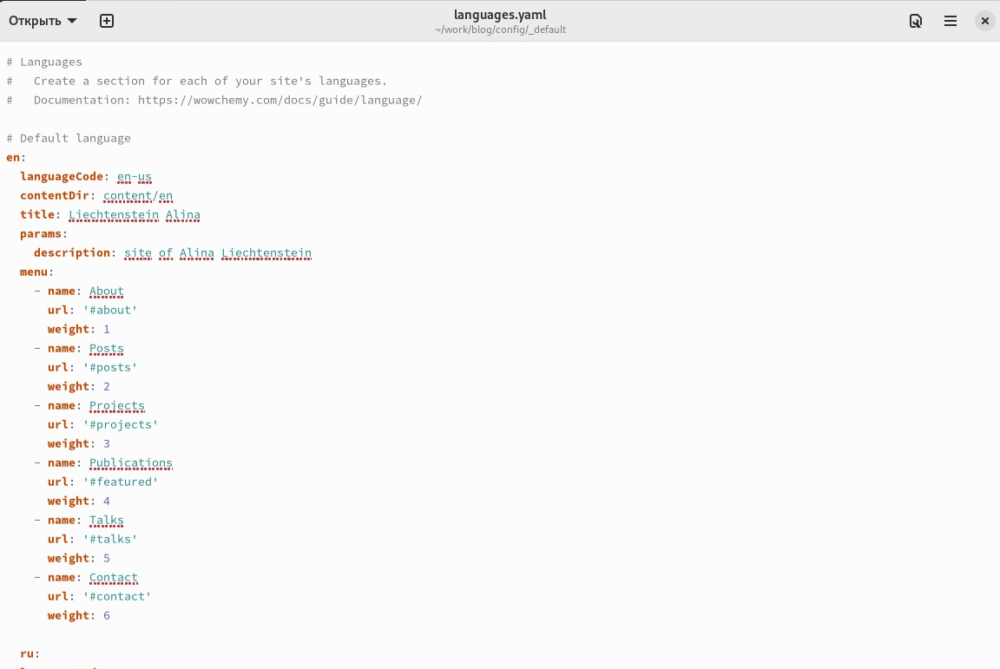
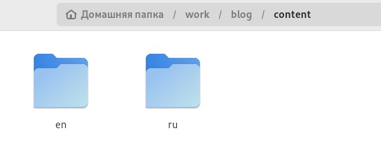
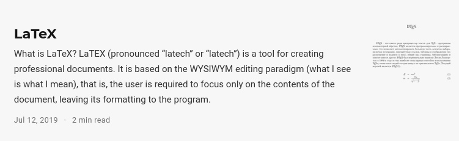
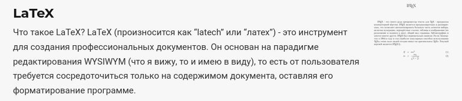

---
## Front matter
lang: ru-RU
title: ОТЧЕТ О ВЫПОЛНЕНИИ ИНДИВИДУАЛЬНОГО ПРОЕКТА. ЭТАП №6
subtitle: Курс "Операционные Системы"
author:
  - Лихтенштейн А.А. , НКАбд-03-22
institute:
  - Российский университет дружбы народов, Москва, Россия
  
date: 23 мая 2023

## i18n babel
babel-lang: russian
babel-otherlangs: english

## Formatting pdf
toc: false
toc-title: Содержание
slide_level: 2
aspectratio: 169
section-titles: true
theme: metropolis
header-includes:
 - \metroset{progressbar=frametitle,sectionpage=progressbar,numbering=fraction}
 - '\makeatletter'
 - '\beamer@ignorenonframefalse'
 - '\makeatother'
---

## Докладчик

:::::::::::::: {.columns align=center}
::: {.column width="40%"}

  * Лихтенштейн Алина Алексеевна
  * студент группы НКАбд-03-22
  * кафедры Компьютерные и информационные науки 
  * Российский университет дружбы народов
  * [1132229533@pfur.ru](mailto:1132229533@pfur.ru)
  

:::
::: {.column width="30%"}

:::
::::::::::::::

# Цель работы

Размещение двуязычного сайта на Github

# Задачи 

- Сделать поддержку английского и русского языков.
- Разместить элементы сайта на обоих языках.
- Разместить контент на обоих языках.
- Сделать пост по прошедшей неделе.
- Добавить пост на тему по выбору (на двух языках).

# Выполнение лабораторной работы
## Реализация поддержки сайтом английского и русского языков
Сделаем поддержку английского и русского языков:

## Редактирование файлов конфигурации

Сделаем поддержку английского и русского языков:
Отредактируем файл config.yaml 

{#fig:001 width=100%}

##

Отредактируем файл languages.yaml 

{#fig:002 width=100%}

## Редактирование контента
В зависимости от выбранного языка содержимое будет переведено на соответствующий. Это реализовано с помощью создания нескольких каталогов с одинаковым по смыслу содержимым, но на написанным разных языках (редактирование приходится делать вручную) 

{#fig:003 width=100%}

Путь к этим каталогам прописан в файлах, редактируемых ранее.

## Пост по прошедшей неделе
Сделан пост по прошлой неделе на русском и английском языке 

{#fig:004 width=100%}

##

{#fig:005 width=100%}

# Выводы
В процессе выполнения этапа индивидуального проекта был размещен двуязычный сайт на Github.
